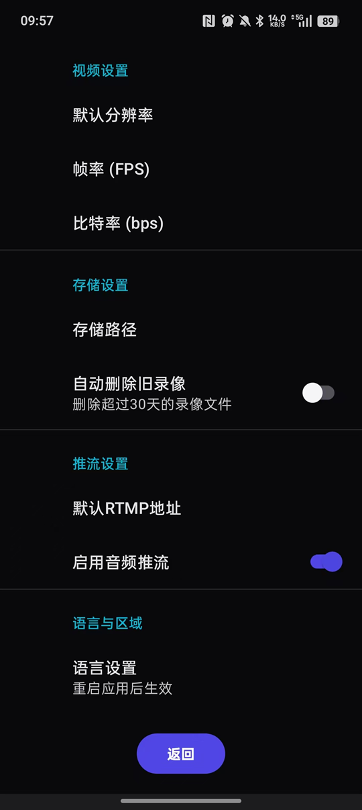
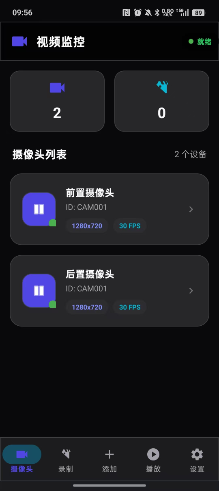
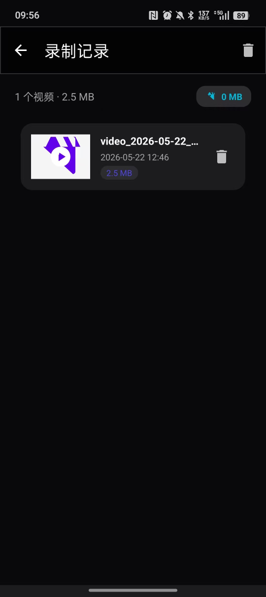

# Camera Stream Monitor / 摄像头流媒体监控

[](https://www.android.com)
[](https://kotlinlang.org)
[](https://developer.android.com/about/versions)
[](LICENSE)

**English** | [中文](#中文)

---

## 📸 Project Overview / 项目简介

Camera Stream Monitor is a powerful Android application for real-time video streaming, monitoring, and recording. It provides comprehensive camera management capabilities with support for multiple streaming protocols.

摄像头流媒体监控是一款功能强大的 Android 应用程序，用于实时视频流、监控和录制。它提供全面的摄像头管理功能，支持多种流媒体协议。

---

## ✨ Features / 功能特性

### 🎥 Core Features / 核心功能

- **Multi-Camera Support / 多摄像头支持**
  - Front and rear camera management
  - 前置和后置摄像头管理
  - Support for multiple camera configurations
  - 支持多种摄像头配置

- **Real-time Streaming / 实时推流**
  - RTMP streaming protocol support
  - RTMP 推流协议支持
  - RTSP server for local streaming
  - RTSP 本地流媒体服务
  - SRT protocol support (via RootEncoder)
  - SRT 协议支持（通过 RootEncoder）

- **Video Recording / 视频录制**
  - High-quality video recording
  - 高质量视频录制
  - Background recording service
  - 后台录制服务
  - Recording management and playback
  - 录制管理和回放

- **Live Monitoring / 实时监控**
  - Real-time video preview
  - 实时视频预览
  - Stream status monitoring
  - 推流状态监控
  - Network quality indicators
  - 网络质量指示器

### 🔧 Advanced Features / 高级功能

- **Stream Protocols / 流媒体协议**
  - RTMP (Real-Time Messaging Protocol)
  - RTSP (Real Time Streaming Protocol)
  - SRT (Secure Reliable Transport)
  - UDP (User Datagram Protocol)

- **Technical Stack / 技术栈**
  - **CameraX**: Modern camera API
  - **ExoPlayer (Media3)**: Professional video player
  - **RootEncoder**: Audio/video encoding library
  - **Kotlin Coroutines**: Asynchronous programming
  - **View Binding**: Type-safe view access
  - **Material Design 3**: Modern UI components

### 🎨 User Interface / 用户界面

- Material Design 3 interface
- Material Design 3 界面
- Bottom navigation for easy access
- 底部导航栏便于操作
- Real-time status indicators
- 实时状态指示器
- Responsive layout design
- 响应式布局设计

---

## 📱 Screenshots / 应用截图

### 1. Main Interface / 主界面 — 摄像头列表
<p align="center">

</p>

Camera list with device information — 前置/后置摄像头管理，实时状态显示

### 2. Player / 播放器 — 远程观看
<p align="center">

</p>

Stream player with multi-protocol support (RTMP / RTSP / HLS / DASH) — 支持多种流媒体协议输入

### 3. Settings / 设置
<p align="center">

</p>

Video quality, storage, streaming & language settings — 视频/存储/推流/语言配置

### 4. Recordings / 录制记录
<p align="center">

</p>

Recording management and playback — 录制文件管理与回放

---

## 🚀 Getting Started / 快速开始

### Prerequisites / 环境要求

- **Android Studio**: Hedgehog or later
- **Android Studio**: Hedgehog 或更高版本
- **Min SDK**: Android 8.0 (API level 26)
- **Min SDK**: Android 8.0 (API 26)
- **Target SDK**: Android 14 (API level 34)
- **Target SDK**: Android 14 (API 34)
- **Gradle**: 8.0+
- **JDK**: 17 or higher

### Installation / 安装步骤

#### Clone the Repository / 克隆仓库

```bash
git clone https://github.com/nilgpt2024/Camera-Stream-Monitor.git
cd Camera-Stream-Monitor
```

#### Open in Android Studio / 在 Android Studio 中打开

1. Open Android Studio
   打开 Android Studio
2. Select "Open an existing project"
   选择"打开现有项目"
3. Navigate to the cloned directory
   导航到克隆的目录
4. Wait for Gradle sync to complete
   等待 Gradle 同步完成

#### Build the Project / 构建项目

```bash
# Debug build / 调试版本构建
./gradlew assembleDebug

# Release build / 发布版本构建
./gradlew assembleRelease
```

#### Install on Device / 安装到设备

```bash
# Install debug APK / 安装调试 APK
./gradlew installDebug

# Or install release APK / 或安装发布 APK
./gradlew installRelease
```

---

## 📖 Usage Guide / 使用指南

### Basic Operations / 基本操作

#### 1. Add Camera / 添加摄像头

1. Tap the "+" button in bottom navigation
   点击底部导航栏的"+"按钮
2. Configure camera settings (name, ID, etc.)
   配置摄像头设置（名称、ID等）
3. Save configuration
   保存配置

#### 2. Start Monitoring / 开始监控

1. Select camera from list
   从列表中选择摄像头
2. Tap to enter monitor interface
   点击进入监控界面
3. Preview video stream
   预览视频流

#### 3. Start Streaming / 开始推流

1. In monitor interface, tap "Stream" button
   在监控界面，点击"推流"按钮
2. Enter stream URL (RTMP/RTSP address)
   输入推流地址（RTMP/RTSP 地址）
3. Configure stream parameters (quality, bitrate)
   配置推流参数（质量、比特率）
4. Tap "Start" to begin streaming
   点击"开始"启动推流

#### 4. Record Video / 录制视频

1. In monitor interface, tap "Record" button
   在监控界面，点击"录制"按钮
2. Choose recording quality
   选择录制质量
3. Tap "Start" to begin recording
   点击"开始"启动录制
4. Tap "Stop" when finished
   完成后点击"停止"

### Configuration / 配置说明

#### Stream URL Examples / 推流地址示例

```bash
# RTMP Example / RTMP 示例
rtmp://your-server.com/live/stream_key

# RTSP Example / RTSP 示例
rtsp://localhost:8554/live

# SRT Example / SRT 示例
srt://your-server.com:9998?streamid=live/stream_key
```

#### Recommended Settings / 推荐设置

- **Video Resolution**: 1080p or 720p
- **视频分辨率**: 1080p 或 720p
- **Frame Rate**: 30 fps
- **帧率**: 30 fps
- **Bitrate**: 2000-4000 kbps
- **比特率**: 2000-4000 kbps
- **Audio Sample Rate**: 44100 Hz
- **音频采样率**: 44100 Hz

---

## 🏗️ Project Structure / 项目结构

```
Camera-Stream-Monitor/
├── app/
│   ├── src/main/
│   │   ├── java/com/andwin/video/
│   │   │   ├── MainActivity.kt              # Main activity / 主活动
│   │   │   ├── VideoMonitorApp.kt           # Application class / 应用类
│   │   │   ├── camera/
│   │   │   │   └── CameraManager.kt         # Camera management / 摄像头管理
│   │   │   ├── model/
│   │   │   │   └── CameraConfig.kt          # Data model / 数据模型
│   │   │   ├── player/
│   │   │   │   └── StreamPlayer.kt          # Video player / 视频播放器
│   │   │   ├── service/
│   │   │   │   ├── StreamService.kt         # Streaming service / 推流服务
│   │   │   │   └── RecordService.kt         # Recording service / 录制服务
│   │   │   ├── streamer/
│   │   │   │   ├── DirectStreamServer.kt    # Direct stream server / 直播服务器
│   │   │   │   └── StreamPublisher.kt       # Stream publisher / 推流发布者
│   │   │   └── utils/
│   │   │       └── Helpers.kt               # Utility functions / 工具函数
│   │   └── res/                             # Resources / 资源文件
│   └── build.gradle.kts                     # App build config / 应用构建配置
├── gradle/
│   └── libs.versions.toml                   # Version catalog / 版本目录
├── build.gradle.kts                         # Project build config / 项目构建配置
├── settings.gradle.kts                      # Project settings / 项目设置
├── gradle.properties                        # Gradle properties / Gradle 属性
└── README.md                                # This file / 本文件
```

---

## 🛠️ Technology Stack / 技术栈

### Core Dependencies / 核心依赖

| Library | Version | Description | 说明 |
|---------|---------|-------------|------|
| **CameraX** | 1.3.4 | Modern camera API | 现代化摄像头 API |
| **Media3 ExoPlayer** | 1.3.1 | Video player engine | 视频播放引擎 |
| **RootEncoder** | 2.4.6 | Audio/video encoder | 音视频编码器 |
| **RTSP Server** | 1.2.8 | Local RTSP server | 本地 RTSP 服务器 |
| **OkHttp** | 4.12.0 | HTTP client | HTTP 客户端 |
| **Gson** | 2.10.1 | JSON parser | JSON 解析器 |
| **Coroutines** | 1.7.3 | Async programming | 异步编程库 |

### Development Tools / 开发工具

- **Language**: Kotlin
- **语言**: Kotlin
- **Build System**: Gradle with Kotlin DSL
- **构建系统**: Gradle + Kotlin DSL
- **Min SDK**: 26 (Android 8.0)
- **Target SDK**: 34 (Android 14)
- **Architecture**: MVVM + Clean Architecture
- **架构**: MVVM + 清洁架构
- **UI Framework**: Jetpack Compose + ViewBinding
- **UI 框架**: Jetpack Compose + ViewBinding

---

## 🔧 Development / 开发说明

### Build Variants / 构建变体

```bash
# Debug version (for development) / 调试版本（用于开发）
./gradlew assembleDebug

# Release version (for production) / 发布版本（用于生产）
./gradlew assembleRelease
```

### Code Style / 代码规范

- Follow Kotlin official coding conventions
- 遵循 Kotlin 官方编码规范
- Use meaningful variable and function names
- 使用有意义的变量和函数名
- Add comments for complex logic
- 为复杂逻辑添加注释
- Maintain consistent formatting
- 保持一致的格式化

### Contributing / 贡献指南

We welcome contributions! Please follow these steps:

我们欢迎贡献！请遵循以下步骤：

1. Fork the repository
   Fork 本仓库
2. Create your feature branch (`git checkout -b feature/AmazingFeature`)
   创建功能分支
3. Commit your changes (`git commit -m 'Add some AmazingFeature'`)
   提交更改
4. Push to the branch (`git push origin feature/AmazingFeature`)
   推送到分支
5. Open a Pull Request
   创建 Pull Request

---

## ❓ FAQ / 常见问题

### Q: What permissions does this app need?
问：这个应用需要什么权限？

**A:** The app requires the following permissions:
**答：**应用需要以下权限：
- `CAMERA` - Access camera hardware / 访问摄像头硬件
- `RECORD_AUDIO` - Record audio / 录制音频
- `WRITE_EXTERNAL_STORAGE` - Save recordings / 保存录制文件
- `READ_EXTERNAL_STORAGE` - Read saved files / 读取已保存文件
- `POST_NOTIFICATIONS` (Android 13+) - Show notifications / 显示通知

### Q: Which streaming protocols are supported?
问：支持哪些流媒体协议？

**A:** The app supports:
**答：**应用支持：
- RTMP (recommended for live streaming) / RTMP（推荐用于直播）
- RTSP (for local streaming) / RTSP（用于本地流媒体）
- SRT (for secure transmission) / SRT（用于安全传输）
- UDP (for low-latency scenarios) / UDP（用于低延迟场景）

### Q: What is the minimum Android version required?
问：最低需要什么版本的 Android？

**A:** The app requires Android 8.0 (API level 26) or higher.
**答：**应用需要 Android 8.0 (API 26) 或更高版本。

### Q: How do I configure stream quality?
问：如何配置推流质量？

**A:** You can adjust stream quality in the settings menu:
**答：**你可以在设置菜单中调整推流质量：
- Video resolution (720p, 1080p)
- 视频分辨率（720p、1080p）
- Frame rate (15, 24, 30 fps)
- 帧率（15、24、30 fps）
- Bitrate (1000-8000 kbps)
- 比特率（1000-8000 kbps）

---

## 📄 License / 许可证

This project is licensed under the MIT License - see the [LICENSE](LICENSE) file for details.

本项目基于 MIT 许可证开源 - 详见 [LICENSE](LICENSE) 文件。

---

## 🙏 Acknowledgments / 致谢

- **[CameraX](https://developer.android.com/camera)** - Google's modern camera solution
- Google 的现代化摄像头解决方案
- **[ExoPlayer/Media3](https://github.com/google/ExoPlayer)** - Google's media player library
- Google 的媒体播放器库
- **[RootEncoder](https://github.com/pedroSG94/RootEncoder)** - Powerful audio/video encoding library
- 强大的音视频编码库
- **[Android Developers](https://developer.android.com)** - Official Android development resources
- Android 官方开发资源

---

## 📞 Contact / 联系方式

- **Project Repository**: https://github.com/nilgpt2024/Camera-Stream-Monitor
- **项目仓库**: https://github.com/nilgpt2024/Camera-Stream-Monitor
- **Issues**: [Submit issues here](https://github.com/nilgpt2024/Camera-Stream-Monitor/issues)
- **问题反馈**: [在此提交问题](https://github.com/nilgpt2024/Camera-Stream-Monitor/issues)

---

## 🌟 Star History / 星标历史

If this project helps you, please give it a ⭐!

如果这个项目对你有帮助，请给它一个 ⭐！

<a href="https://github.com/nilgpt2024/Camera-Stream-Monitor/stargazers">
    
</a>

---

**Made with ❤️ using Kotlin & Android**

**使用 Kotlin 和 Android 制作 ❤️**

---

## 中文

> 以上内容为中文版说明。如需查看英文版，请返回顶部。

### 项目概述

摄像头流媒体监控是一款专业的 Android 视频监控应用，主要功能包括：

- **实时视频预览**：支持前置和后置摄像头的实时画面显示
- **多协议推流**：支持 RTMP、RTSP、SRT、UDP 等主流推流协议
- **高清录制**：支持高质量视频录制和后台录制服务
- **设备管理**：支持多摄像头配置和管理
- **现代界面**：采用 Material Design 3 设计语言

### 适用场景

- 家庭安防监控
- 直播推流
- 视频会议录制
- 远程监控
- 教育培训录像

### 技术亮点

- 使用 CameraX 实现现代化的摄像头控制
- 采用 Media3 ExoPlayer 进行专业级视频播放
- 基于 RootEncoder 实现高效音视频编码
- 使用 Kotlin Coroutines 实现异步编程
- 遵循 MVVM 架构模式，代码结构清晰

---

<div align="center">

**感谢使用 Camera Stream Monitor！**

**Thanks for using Camera Stream Monitor!**

⭐ 如果这个项目对你有帮助，请给个星标支持一下！⭐

</div>
